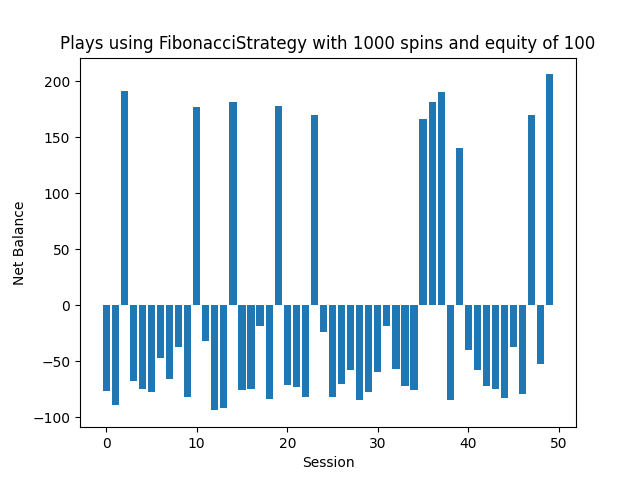
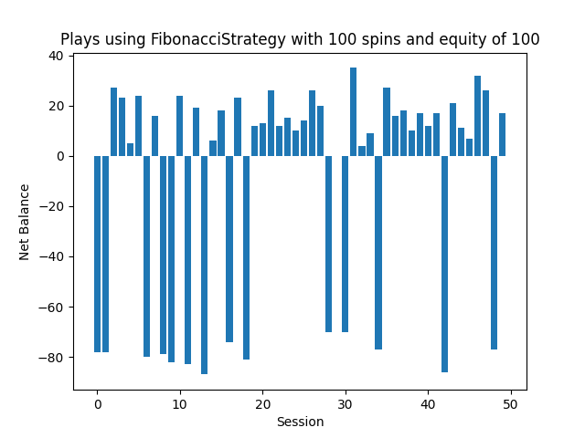

# Roulette Calculator

[](https://opensource.org/licenses/MIT)

## Description

The Roulette Calculator is a program that helps calculate various statistics and probabilities related to the game of roulette. It can be used to analyze different betting strategies, simulate outcomes, and make informed decisions while playing roulette.

## Examples
| Example 1 | Example 2 |
|-----------|-----------|
|  |  |


## Features

- Calculate the probability of winning for different types of bets
- Simulate roulette spins and analyze the outcomes
- Evaluate the effectiveness of different betting strategies
- Provide statistical insights and recommendations

## Installation

1. Clone the repository:

    ```bash
    git clone https://github.com/your-username/roulette-calculator.git
    ```

2. Install the required dependencies:

    ```bash
    python -m venv .roulettecalculator
    pip install -r requirements.txt
    ```

## Usage

1. Run the program:

    ```bash
    source .roulettecalculator/bin/activate
    python main.py
    ```

2. Change and configure `main.py` as you wish to customize the program's behavior.

## Contributing

Contributions are welcome! If you find any issues or have suggestions for improvements, please open an issue or submit a pull request.

## License

This project is licensed under the [MIT License](https://opensource.org/licenses/MIT).